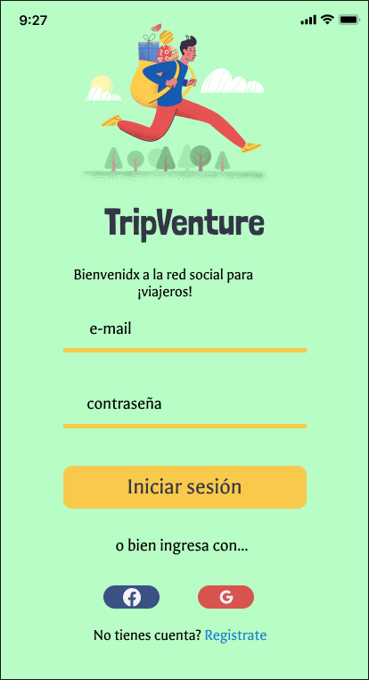

# Tripventure 🎒 🧗🏼

Tripventure es una red social para viajerxs de todo el mundo que amen las aventuras, y quieran compartir sus experiencias, tips, consejos de viaje, dar a conocer los magníficos lugares que tiene el mundo y conocer a mas viajerxs! 

## Historias de Usuario

#### H.U. N°1 🧐 - Crear una cuenta con email y contraseña.

___Descripción:___ Como usuario nuevo debo poder crear una cuenta con email y password válidos para poder iniciar sesion e ingresar a la red social

___Criterios de Aceptación___

* Mostrar un mensaje según se ingrese la informacion de email y passord que le indique al usuario si los datos ingresados cumplen con las características de los mismos
* Mostrar un que indique el email de verificación para la cuenta. 
* Debe ser responsive
* No debe necesitar recargar la página para crear una cuenta (SPA)

___Definicion Determinado___

* La funcionalidad cumple satisface los criterios de aceptación.
* La funcionalidad cubre test unitario con un mínimo de 70%.
* El diseño visual corresponde al prototipo de alta fidelidad.
* La funcionalidad esta desplegada y pública para ser probada.
* La funcionalidad fue probada manualmente.
* Se hicieron pruebas de usuabilidad y se implementó el feedback si se consideró necesario.

#### H.U. N°2 🧐 - - Iniciar sesion con Google y Faceboock
___Descripción:___ Como usuario nuevo debo poder tener la opción de iniciar sesión con mi cuenta de Google o Facebook para ingresar a la red social sin necesidad de crear una cuenta de email válido.

___Criterios de Aceptación___
* mostrar la opción de ingresar a la red social con Google o Faceboock
* Debe ser responsive
* No debe necesitar recargar la página para crear una cuenta (SPA)

___Definicion Determinado___

* La funcionalidad cumple satisface los criterios de aceptación.
* La funcionalidad cubre test unitario con un mínimo de 70%.
* El diseño visual corresponde al prototipo de alta fidelidad.
* La funcionalidad esta desplegada y pública para ser probada. (GitHub)
* La funcionalidad fue probada manualmente.
* Se hicieron pruebas de usuabilidad y se implementó el feedback si se consideró necesario.

#### H.U. N°3 🧐

## Prototipo para mobile
**Sign up**

